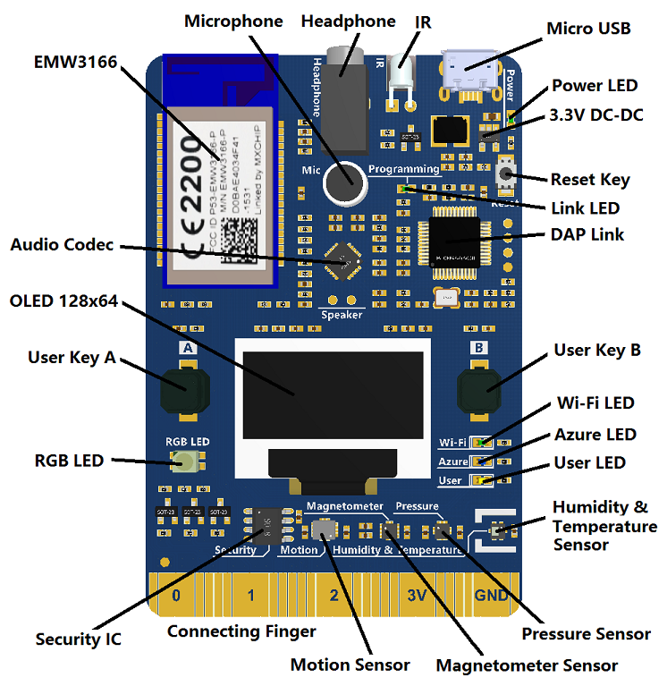

# MXChip Workshop

This workshop is a hands-on lab for getting started building a cloud connected IoT device using the [MXChip Iot DevKit prototyping board](http://mxchip.com/az3166) and the [Azure IoT Hub](https://azure.microsoft.com/services/iot-hub/?WT.mc_id=iothub-github-jabenn).

The final project that will be created is an internet connected temperature sensor, with a warning light if the temperature is above a certain threshold. The temperature will be reported to Azure IoT Hub and stored in a table. This value can be retrieved via an API built using Azure functions. To control the LED, a threshold will be set using another Azure Function API, and this will sync to the device using a [device twin](https://docs.microsoft.com/azure/iot-hub/tutorial-device-twins/?WT.mc_id=iothub-github-jabenn).

## What is the MXChip

The MXChip is an Arduino compatible prototyping board. It is an all-in-one board with a cortex-M micro-controller, WiFi, an array of sensors including temperature and pressure, LEDs, buttons, a screen, a microphone and headphone port. It is also designed to easily talk to  Azure IoT Hub.



## What is Azure IoT Hub

Azure IoT Hub is an Azure service that allows you to connect, monitor and manage IoT devices at scale, from a few to billions. IoT Hub is an open and flexible cloud platform as a service that supports open-source SDKs and multiple protocols.

You can read more at [azure.microsoft.com/services/iot-hub](https://azure.microsoft.com/services/iot-hub/?WT.mc_id=iothub-github-jabenn)

## Getting started

Before you can work through this lab, you will need some hardware, software and an Azure account.

This workshop has been tested on Windows 10 and MacOS Mojave. It should also work on Ubuntu, but this [hasn't been validated yet](https://github.com/jimbobbennett/MXChip-Workshop/issues/1).

### Hardware

This workshop is based on the MXChip Iot DevKit, so you will need to purchase one of these boards. You can do so from:

* [Amazon](https://amzn.to/2CdVgB1)
* [DFRobot](https://www.dfrobot.com/product-1616.html)
* [Seeed](https://www.seeedstudio.com/AZ3166-IOT-Developer-Kit-p-2922.html)

### Software

You will need to install a few applications and tools to be able to program this board:

* [Visual Studio Code](https://code.visualstudio.com/Download/?WT.mc_id=iothub-github-jabenn)
* [Arduino IDE](https://www.arduino.cc/en/Main/Software) - **NOTE** On Windows DO NOT install using the Windows store, instead use the *Windows Installer, for Windows XP and up*.
* [Azure Functions Core Tools](https://docs.microsoft.com/azure/azure-functions/functions-run-local/?WT.mc_id=iothub-github-jabenn)
* The [ST-Link/V2](http://www.st.com/en/development-tools/st-link-v2.html) is the USB interface that IoT DevKit uses to communicate with your development machine. Follow the platform specific steps to allow the machine access to your device.

  * Windows: Download and install USB driver from [STMicro](http://www.st.com/en/development-tools/stsw-link009.html).

  * macOS: No driver is required for macOS.

  * Linux: Run the following in terminal and logout and login for the group change to take effect:

    ```bash
    # Copy the default rules. This grants permission to the group 'plugdev'
    sudo cp ~/.arduino15/packages/AZ3166/tools/openocd/0.10.0/linux/contrib/60-openocd.rules /etc/udev/rules.d/
    sudo udevadm control --reload-rules

    # Add yourself to the group 'plugdev'
    # Logout and log back in for the group to take effect
    sudo usermod -a -G plugdev $(whoami)
    ```

### Azure account

To use Azure IoT Hub you will need an Azure subscription. If you don't have a subscription you can sign up for free at [azure.microsoft.com/free/](https://azure.microsoft.com/free/?WT.mc_id=iothub-github-jabenn).

At the time of writing the free account will give you US$200 of free credit to spend on what you like, 12 months of free services, plus a load of services that have tiers that are always free.

For this workshop you can use the free tier of IoT Hub. If you already have an Azure account you can use this, using a free tier IoT Hub.

## The workshop

This workshop is implemented in both C and C#. The code running on the MXChip is in C, the code for the Azure Functions is in C#.

The steps for the workshop are in the [Steps](./Steps) folder.

1. [Configure the MXChip board](./Steps/1.ConfigureTheBoard.md)
2. [Configure Visual Studio Code](./Steps/2.ConfigureVSCode.md)
3. [Showing the temperature](./Steps/3.ShowingTheTemperature.md)