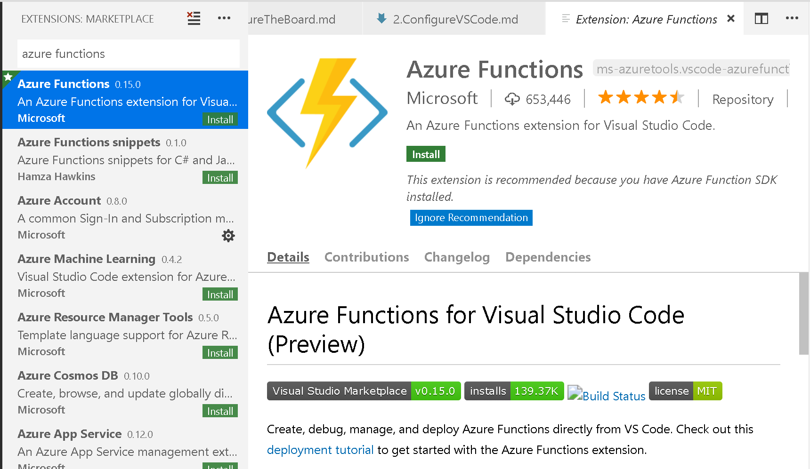
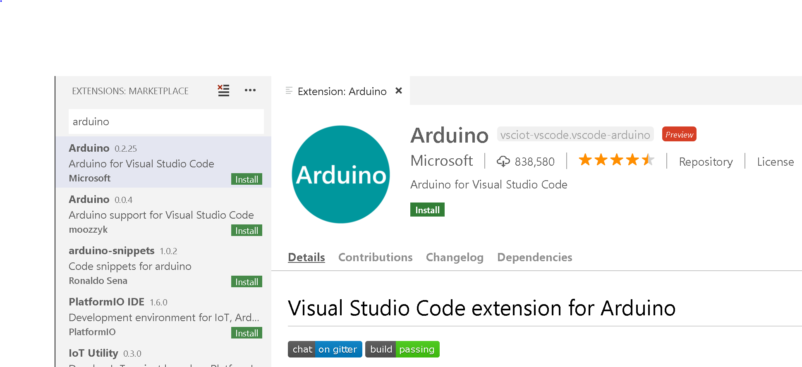
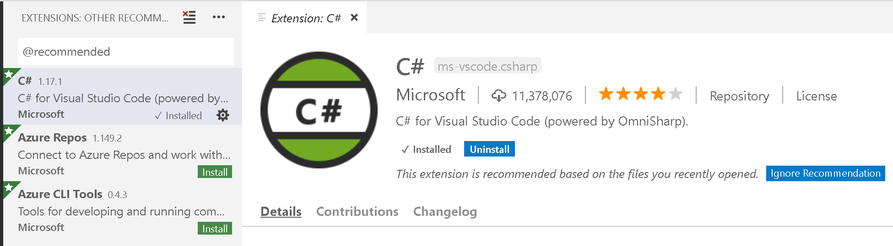
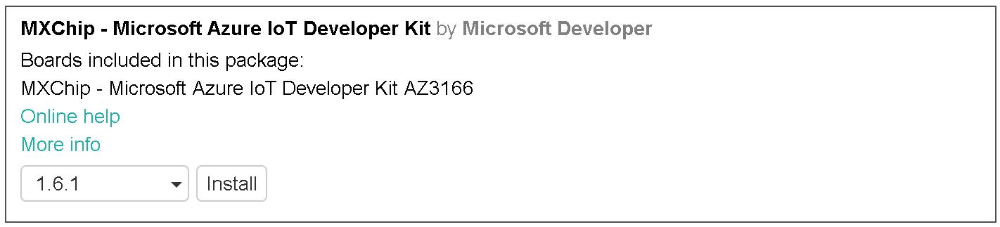

# 2 - Configure Visual Studio Code

In the [previous section](./1.ConfigureTheBoard.md) you configured the MXChip board. In this section you configure Visual Studio Code ready to work with the board.

Visual Studio Code can be used to code the MXChip, including pushing the compiled code to the board by automating the Arduino IDE. It can also be used to publish code to Azure and configure services.

## Installing the IoT extension

Visual Studio Code has a wealth of extensions that provide different capabilities to the editor. There is one designed for IoT.

* Launch Visual Studio Code
* Select **Extensions** from the side bar
* Search for the *Azure IoT Device Workbench* extension and install it

* Search for the *Azure Functions* extension and install it.

* Search for the *Arduino* extension and install it.

* Search for the *C#* extension and install it.


## Configuring Visual Studio Code for IoT development

* Open the command palette
  * On Windows or Linux use Ctrl+Shift+P.
  * On MacOS use Cmd+Shift+P
* Type `Preferences` and select *Preferences: Open Settings (JSON)*
* Add the following Arduino settings:
  * Windows

    ```JSON
    "arduino.path": "C:\\Program Files (x86)\\Arduino",
    "arduino.additionalUrls": "https://raw.githubusercontent.com/VSChina/azureiotdevkit_tools/master/package_azureboard_index.json"
    ```

  * macOS

    ```JSON
    "arduino.path": "/Applications",
    "arduino.additionalUrls": "https://raw.githubusercontent.com/VSChina/azureiotdevkit_tools/master/package_azureboard_index.json"
    ```

  * Linux

    ```JSON
    "arduino.path": "/home/{username}/Downloads/arduino-1.8.5",
    "arduino.additionalUrls": "https://raw.githubusercontent.com/VSChina/azureiotdevkit_tools/master/package_azureboard_index.json"
    ```

* Open the command palette and select *Arduino: Board Manager*. Search for `MXChip` and install the latest version.

* Restart Visual Studio Code
* From the command palette select *Arduino: Board Config*. Select the *MXChip AZ3116* board.
* From the command palette select *Arduino: Select Serial Port".
  * On Windows, select *COM5 STMicroElectronics*
  * On MacOS, select */dev/cu.usbmodem<xxxx>*

<hr>

After this step is complete, move on to the next step, [Making an LED flash](./3.MakingAnLEDFlash.md)