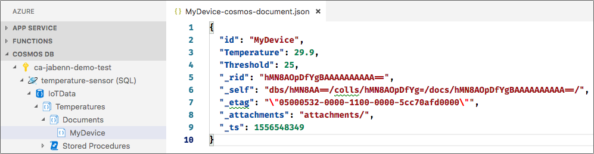

# 5 - Store the temperature using Azure Functions and Cosmos DB

In the [previous step](./4.SendingTheTemperature.md) you configured an Azure IoT Hub service and device, wrote some more code in C to run on the MXChip board. This code connected the device to WiFI and the IoT Hub, and sent a message containing the temperature and threshold. In this step you will create an Azure Functions back end to take these messages and save the values into a [Cosmos DB collection](https://azure.microsoft.com/services/cosmos-db/?WT.mc_id=mxchipworkshop-github-jabenn).

## Store the temperature

When a message is received by the IoT Hub, the temperature needs to be extracted and stored somewhere against the device name. This can be done using [Azure functions](https://azure.microsoft.com/services/functions/?WT.mc_id=mxchipworkshop-github-jabenn), binding a function to the messages received from the IoT Hub with it's output bound to a Cosmos DB collection.

### Create a Cosmos DB account to store temperatures

* From the [Azure Portal](https://portal.azure.com/?WT.mc_id=mxchipworkshop-github-jabenn), click *+ Create a resource* from the sidebar.
* Search for *Azure Cosmos DB*, then click **Create**.
* Select the existing `temperaturesensor` resource group that you used for the IoT Hub.
  > It is important to use the same resource group for the Cosmos DB that you created when provisioning the IoT Hub. When you have finished with this project you will need to delete the resources you have created to avoid using up credit or free service limits, and this is easier to do if everything is in one resource group
* Give the instance a unique name, it can be the same name you used for the IoT Hub, although you are limited to lowercase letters and numbers, and the name has to be no more than 31 characters.
* Make sure the API is set to Core (SQL)
* Select a region closest to you
* Leave the defaults for the other fields
* Click **Review + create**, then **Create**

It will take a few minutes for this to be provisioned. Whilst this is happening you can build the API.

## Create the Azure Function back end code

Azure Functions is an event-driven serverless framework, running your code in response to external triggers such as HTTP requests, inserts into a table, or events from an event hub or IoT Hub. An Azure Function can be [connected to your IoT Hub](https://azure.microsoft.com/resources/samples/functions-js-iot-hub-processing/?WT.mc_id=mxchipworkshop-github-jabenn), so that the function is invoked every time a device sends a message, with that message passed into the function.

### Create an IoT Hub trigger

Open Visual Studio Code, and open the `Functions` folder. This folder contains the code and settings for the Azure Functions app. The code itself is in the `IoTHubTrigger1.cs` file, so open this file.

Inside this file is a method called `Run`, decorated with a `FunctionName` attribute. The first parameter to this function is an `EventData` object, decorated with an `IoTHubTrigger` attribute. It is this attribute that tells the functions runtime to listen for messages sent to an IoT Hub and invoke this trigger.

* Add a new `using` directive to the top of the file, below the existing `using` directives

  ```cs
  using Newtonsoft.Json;
  ```

* Add code to the bottom of this function extract the device id from the message:

  ```cs
  var deviceId = message.SystemProperties["iothub-connection-device-id"].ToString();  
  ```

* Add code below this to deserialize the JSON passed in the body of the message and extract the temperature and threshold.

  ```cs
  var jsonBody = Encoding.UTF8.GetString(message.Body);
  dynamic data = JsonConvert.DeserializeObject(jsonBody);
  double temperature = data.temperature;
  double threshold = data.threshold;
  ```

### Create a Cosmos DB collection

By now the Cosmos DB account should be created.

* From the Azure Portal, open the Cosmos DB account using the **Go to resource** button on the deployment page.
* Click **+ Add Collection** from the *Overview* page.
* Set the *Database Id* to be `IoTData` and the *Collection Id* to be `Temperatures`.
* Set the *Partition key* as `/Type` (the forward slash at the start will be added for you if you don't enter it).
* Set the *Throughput* to be `400`. This is the lowest tier and is free with the Azure free account.
* Click *OK*

### Connect the Azure Function to the Cosmos DB collection

From Visual Studio Code, open the `Functions.csproj` file in the `Functions` folder. This is a .NET project file and from here you can add packages to bring in more SDKs, such as the one needed to interact with Cosmos DB.

* Find the `<ItemGroup>` section containing `<PackageReference>` elements.
* Add the following new element to this group:

  ```xml  
  <PackageReference Include="Microsoft.Azure.WebJobs.Extensions.CosmosDB " Version="3.0.3" />
  ```

* A popup will appear in the bottom left asking if you want to restore the packages to download this new reference. Click **Restore**. If you don't see this popup, from the command palette select *.NET: Restore All Projects*.
  
Once the SDK is installed and in use by the project, the Azure Function can be wired up to return a type that gets inserted into the collection, or used to update an existing value.

* Declare a new class to hold the data that will be saved into Cosmos DB. Add this code inside the `namespace IoTWorkbench` declaration, and before the `public class IoTHUbTrigger1` class definition.

  ```cs
  public class TemperatureItem
  {
    [JsonProperty("id")]
    public string Id {get; set;}
    public double Temperature {get; set;}
    public double Threshold {get; set;}
    public string Type {get; set;}
  }
  ```

* Add a new `out` parameter to the `Run` method to return the temperature data.

  ```cs
  public static void Run([IoTHubTrigger("%eventHubConnectionPath%", Connection = "eventHubConnectionString")] EventData message,
                         out TemperatureItem output,
                         ILogger log)
  ```

* Connect this to Cosmos DB by adding a `CosmosDB` attribute to this new parameter.

  ```cs
  public static void Run([IoTHubTrigger("%eventHubConnectionPath%", Connection = "eventHubConnectionString")] EventData message,
                         [CosmosDB(databaseName: "IoTData",
                                   collectionName: "Temperatures",
                                   ConnectionStringSetting = "cosmosDBConnectionString")] out TemperatureItem output,
                         ILogger log)
  ```

  The `CosmosDBConnection` connection string setting will be retrieved from the Azure Function application settings, which will be set later in this step.

* Set the output parameter to be a new `TemperatureItem` using the values from the message, and a `Type` of `"Latest"`. This will create a document keyed off the device id and insert it into the collection. Subsequent messages will update the document in the collection.

  ```cs
  output = new TemperatureItem
  {
    Temperature = temperature,
    Threshold = threshold,
    Id = deviceId,
    Type = "Latest"
  };
  ```

## Deploy the Azure Function app

### Configure the Cosmos DB connection string in the Azure Function app

* Open the [Azure Portal](https://portal.azure.com/?WT.mc_id=mxchipworkshop-github-jabenn)
* Navigate to the new Cosmos DB account.
* Select *Settings->Keys* from the side bar, and copy the *PRIMARY CONNECTION STRING* using the blue **Copy** button.
  
  

* Navigate to your new Azure Function app using the search bar
* Select *Application Settings* from the *Configured features* section of the *Overview* page.
* Add a new setting to the *Application Settings* section with a name of `cosmosDBConnectionString` and the connection string you copied from the Cosmos DB account.
* Click the *Save* button at the top of the page

### Deploy the code

* From the Visual Studio Code command palette, select *Azure IoT Device Workbench: Deploy to Azure...*
* The palette will show you are deploying the Azure Functions app, so press enter to continue
* The deployment will begin. You will be asked if you want to overwrite the existing deployment, so click **Deploy**.
  
  

The function app will be deployed, and this should take a few seconds.

### Restart the Azure Function

* Open the [Azure Portal](https://portal.azure.com/?WT.mc_id=mxchipworkshop-github-jabenn)
* Navigate to your new Azure Function app using the search bar
* Click the **Restart** button from the *Overview* page.

## Monitoring the data

Once the Azure Function app is restarted, the events will flow into the IoT Hub trigger, and get stored in the Cosmos DB collection.

* Navigate to the Cosmos DB account on the Azure portal.
* Select *Data Explorer* from the side bar.
* Expand the *IoTData* database and *Temperatures* collection.
* Select the *Documents* node. A filtering control with a list of documents will appear containing a single entry.
* Click the entry to see the temperature and threshold.

  

<hr>

The full code for the Azure Function is below:

```cs
using IoTHubTrigger = Microsoft.Azure.WebJobs.EventHubTriggerAttribute;

using Microsoft.Azure.WebJobs;
using Microsoft.Azure.WebJobs.Host;
using Microsoft.Azure.EventHubs;
using System.Text;
using System.Net.Http;
using Microsoft.Extensions.Logging;
using Newtonsoft.Json;

namespace IoTWorkbench
{
  public class TemperatureItem
  {
    [JsonProperty("id")]
    public string Id {get; set;}
    public string Type {get; set;}
    public double Temperature {get; set;}
    public double Threshold {get; set;}
  }

  public static class IoTHubTrigger1
  {
    [FunctionName("IoTHubTrigger1")]
    public static void Run([IoTHubTrigger("%eventHubConnectionPath%",
                                          Connection = "eventHubConnectionString")] EventData message,
                           [CosmosDB(databaseName: "IoTData",
                                     collectionName: "Temperatures",
                                     ConnectionStringSetting = "cosmosDBConnectionString")] out TemperatureItem output,
                            ILogger log)
    {
      var deviceId = message.SystemProperties["iothub-connection-device-id"].ToString();

      var jsonBody = Encoding.UTF8.GetString(message.Body);
      dynamic data = JsonConvert.DeserializeObject(jsonBody);
      double temperature = data.temperature;
      double threshold = data.threshold;

      output = new TemperatureItem
      {
        Temperature = temperature,
        Threshold = threshold,
        Id = deviceId,
        Type = "Latest"
      };
    }
  }
}
```

<hr>

In this step you added an Azure Function that was triggered by the messages from the MXChip, and used this to save the temperature to a Cosmos DB Collection. Now move on to the [next step](./6.ExposeTheTemperature.md) where you will expose the temperature data over a REST API.